# DRIDE: Drone Relative Identification of Distance using Embedded Light Sources (IAVI 2024 Fall)

## 1. Introduction

This experiment aims to estimate the altitude and relative position of an aerial vehicle during nighttime using computer vision techniques. By capturing images of the aircraft and leveraging known technical parameters (such as the distance between navigation lights), we can use geometric derivation methods to determine the relative distance and altitude information of the aircraft concerning the camera. The experiment mainly includes image processing, feature detection, geometric derivation, and real-time data processing steps to enhance the accuracy of recognizing aircraft light sources under nighttime conditions.

## 2. Background and Significance

In `lecture4.depth`, we explored various depth/distance estimation methods, such as ToF (direct), ToF (cw), and Stereo Depth Estimation. In recent years, nighttime target detection has been applied in various fields, such as aerospace, autonomous driving, and drone navigation systems. This project references existing research on nighttime target detection and aims to verify through experiments whether the known characteristics of an aircraft can be used for distance estimation, ultimately enhancing the positioning accuracy of nighttime aircraft.

    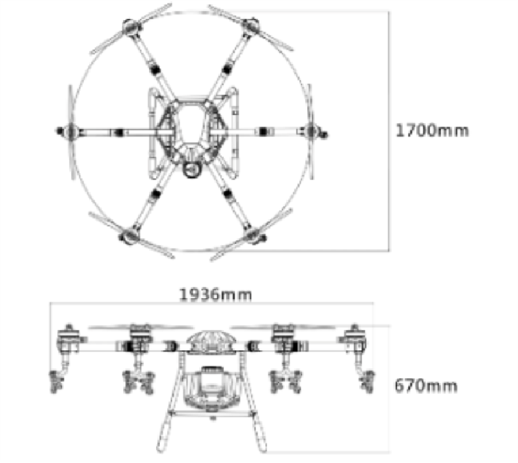
    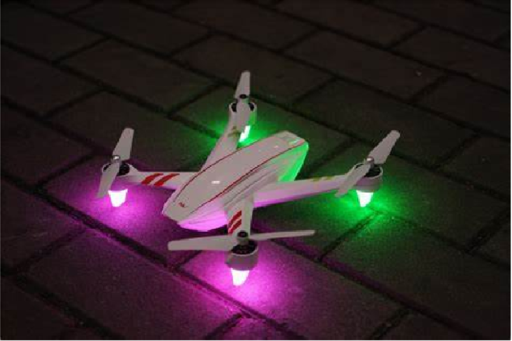

## 3. Experimental Steps

Experiment Design:

- The experiment should progress from simple to complex, adding more content based on a minimum viable experiment.
- Our experimental design follows this sequence: Single light source detection -> Multiple light source detection -> Limiting the number of light sources -> Indoor light source distance measurement -> Indoor drone experiment -> Outdoor drone experiment.

Project pipeline:

    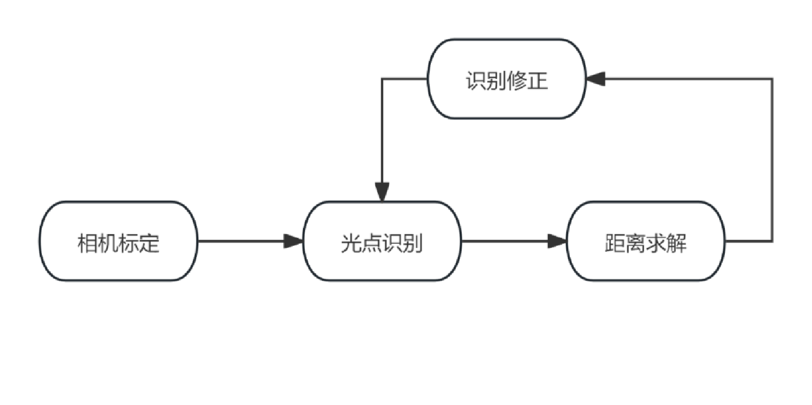

Experiment Focus:

- Adaptation of the `solvePnP` algorithm for this task.
- Resistance to city light interference and correction post-interference.

### 3.1 Equipment and Environment

    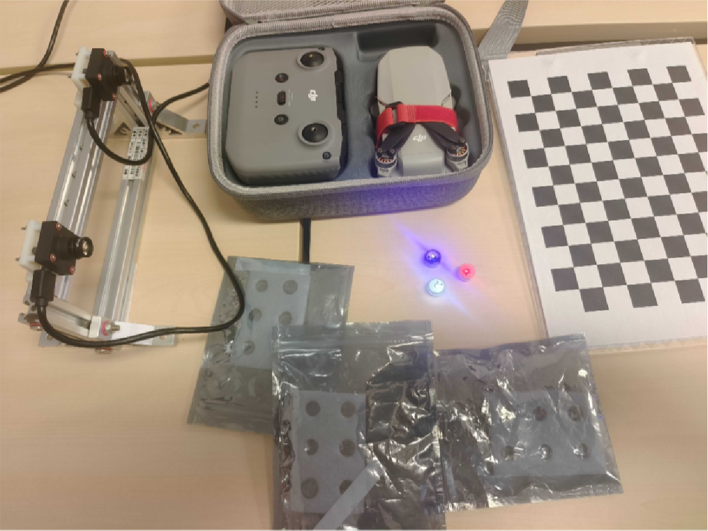
    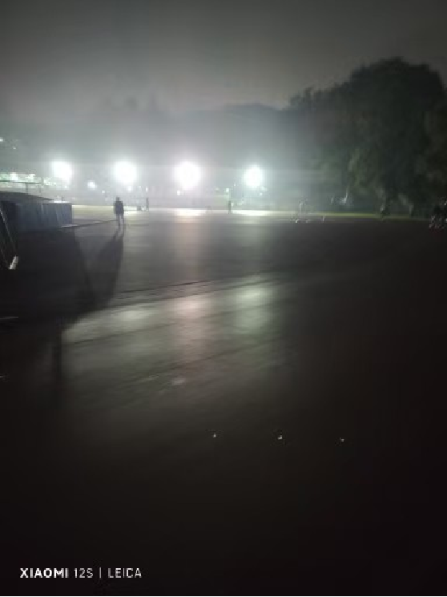

- Camera: Basler industrial camera (calibrated to reduce image distortion).
- Calibration tool: Chessboard calibration board.
- Aircraft: DJI drone mini2se, equipped with red, blue, and white navigation lights.
- Environment: Indoor and outdoor environments.

### 3.2 Image Acquisition and Preprocessing

Camera calibration is performed first to obtain the camera's intrinsic parameters, including focal length and distortion coefficients. Light source detection is divided into the following steps:

1. **Preprocessing**: Denoise each frame of the image.
2. **Color Space Conversion**: Convert the image to HSV space to extract regions that meet the color threshold. We mainly restrict H and V by defining upper and lower limits for color ranges to achieve optimal detection. The red color's temperature spans zero, requiring multiple range limits. Through parameter tuning, we maximized light source detection accuracy under indoor conditions.
3. **Morphological Filtering**: Use HSV-coded masks to aid color recognition, especially with brightness constraints for light detection. All contours processed by the mask are filtered by contour size.
4. **Contour Detection**: Identify regions that meet the criteria, and calculate the centroid and bounding box. For red and blue lights, we select the largest contour, and for white lights, a specific recognition scheme is used.

    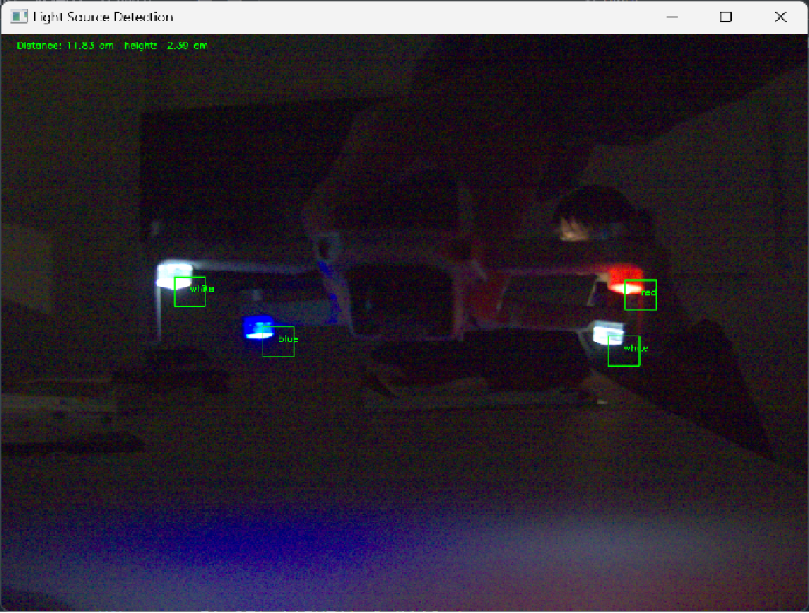

We achieved stable light source locking in illuminated, non-illuminated, and interference conditions, with the best results in dark environments.

### 3.3 Distance and Position Calculation

    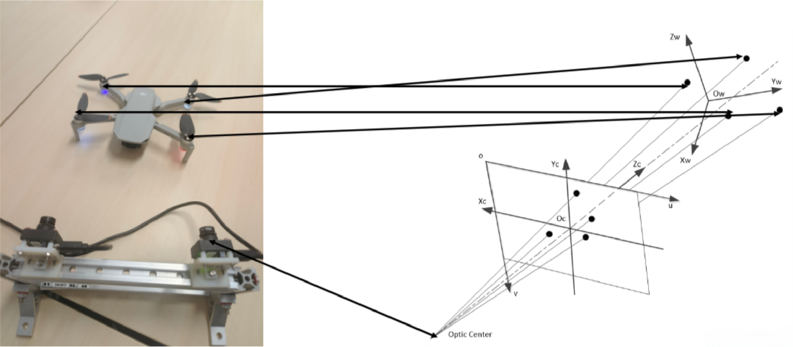

**Geometric Derivation and Calculation**: Using the `SolvePnP` algorithm, a model of the drone is created based on its lights. By calculating the pixel distance between navigation lights and the relative position between the camera and the drone, combined with the camera's pitch angle, we estimate the drone's precise location.

    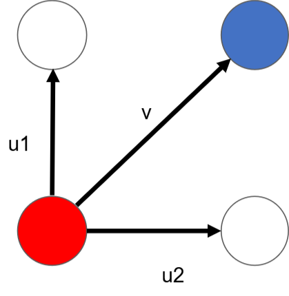

`solvePnP` requires at least four feature points, providing \( 4 \times 2 = 8 \) equations to uniquely determine relative pose. Given the three light colors—red, blue, and white—we use diagonal placement to uniquely identify two lights of the same color. By checking whether the cross-product of vector \( v \) with \( u_1 \) and \( u_2 \) is greater than zero, we can determine the identities of the two white lights.

### 3.4 Interference Resistance

To achieve light source interference resistance, detectable light sources and interference sources must have distinct differences, such as color temperature or brightness, or resistance can be achieved by imposing certain geometric constraints. Alternatively, dynamic adjustment, multi-frame correction, or optical flow methods can provide interference resistance. In this experiment, we mainly used multi-frame correction and geometric constraints to ensure that the light source was fixed on the drone.

#### 3.4.1 Multi-frame Correction

Typically, the drone's movement distance between frames is not large. Using this principle, we can set a limit on the discrepancy of corresponding light source points between consecutive frames (error < threshold), otherwise, data from the previous frame is used. This approach ensures reasonable accuracy in most cases, preventing sudden changes in 2D point positions from causing extreme distance fluctuations.

However, this approach has a limitation: the first frame must be accurate; otherwise, errors propagate to all subsequent frames. Additionally, in our experiments, the Basler camera’s low frame rate sometimes led to large discrepancies in light source position between frames, causing tracking to lock onto the last non-deviant position. A potential solution is to relax the error limit, but this would reduce correction effectiveness.

#### 3.4.2 Using Tracking

We also utilized OpenCV's `trackingAPI`. The initial frame was boxed in blue using the `MILTracking` algorithm to constrain the drone’s position, ensuring light sources remain within the blue box. For drones at moderate speed and distance, position recognition and interference resistance were reliable, but for fast-moving drones or when positions between frames varied greatly, tracking accuracy decreased as the blue box could lose the target. This method also struggled when light sources were insufficient; even a slight deviation in the box led to sources falling outside. This solution requires high accuracy in the tracking algorithm.

## 4. Field Measurement Data Analysis and Results

    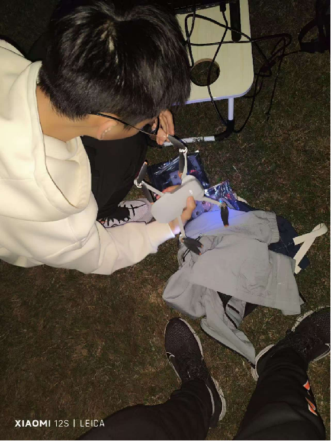

The outdoor drone experiment is the core part of this project. Compared to indoor environments without interference, the outdoor setting is more expansive, complex, and realistic. We used DJI Fly’s position data as a reference, analyzing experimental data for error.

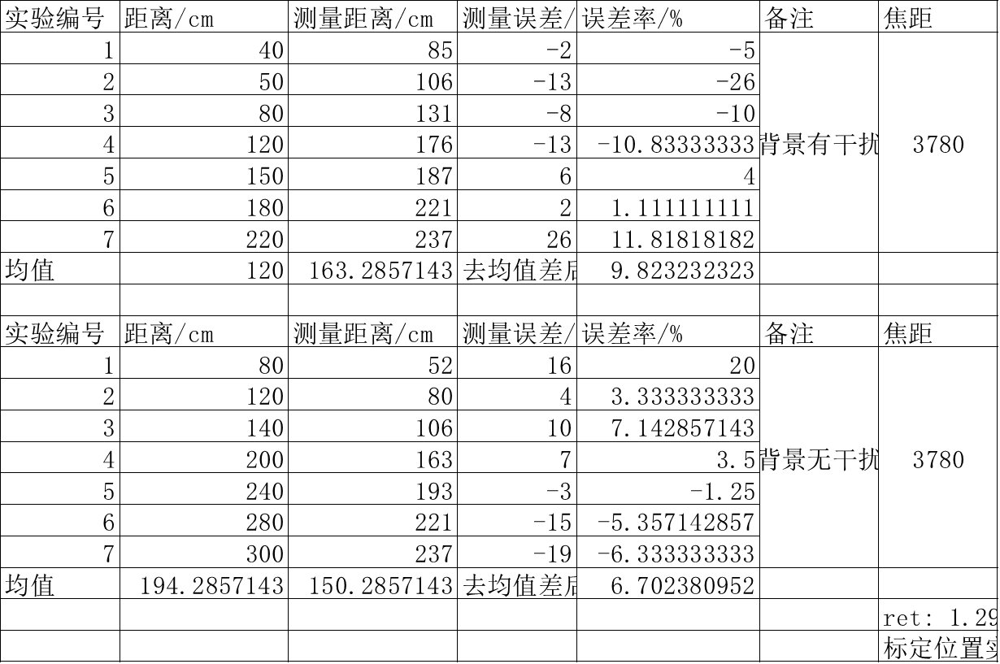

### 4.1 Linear Processing

    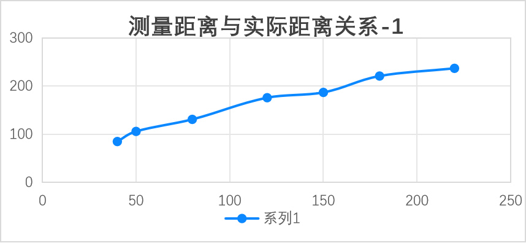
    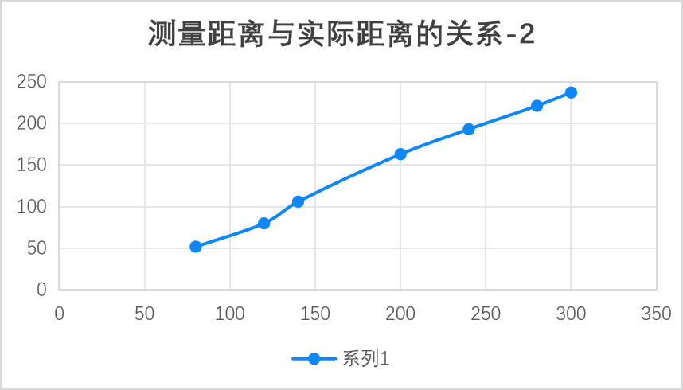

By comparing measured distance with the distance data from the DJI drone, we observed a roughly linear relationship within the measurement range.

### 4.2 Error Analysis

Through repeated experiments, we found a stable 30-40cm error in the DJI drone’s distance measurement system in each run. By calculating the mean difference, we obtained a steady-state error and analyzed the error variation at different distances.

    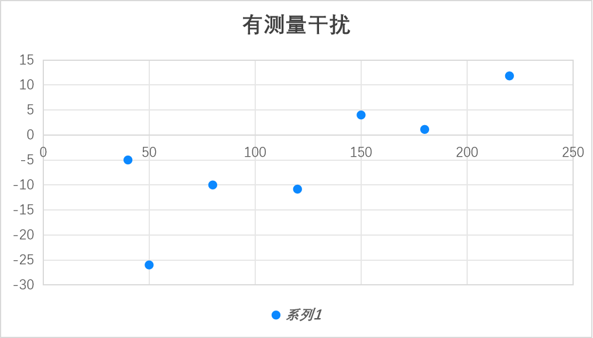
    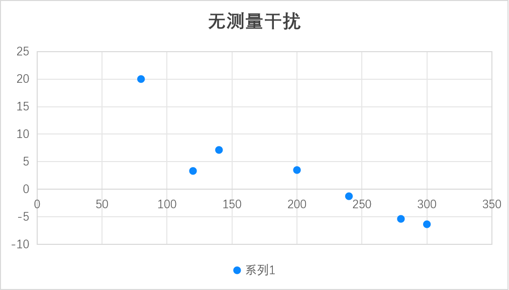

Overall, measurement errors were larger when the aircraft was either too close or too far from the camera. Comparing errors in interference-free and interference conditions revealed lower errors under interference-free conditions.

### 4.3 Optimization Strategies

- **Select More Suitable Experimental Equipment**: Using lights with more unique and varied colors can address interference at its root.
- **Tracking and Interference Resistance**: Using the `MILTracking` algorithm to maintain relative stability of light source positions between frames enhances interference resistance.
- **Improving Distance Recognition Accuracy**: Higher camera calibration accuracy or using a stereo camera for depth information can further optimize distance recognition.

## 5. Conclusion and Insights

This experiment successfully verified the feasibility of using drone navigation lights for nighttime distance estimation, providing potential engineering value. The experiment improved camera accuracy in identifying aircraft at night, but there is still room for improvement in accuracy under ambient light interference and high-speed drone movement. Future work can explore multi-light source geometric constraints or more precise image enhancement algorithms to improve target recognition stability.

## 6. References

i. Han, X., et al. "Low-Illumination Road Image Enhancement by Fusing Retinex Theory and Histogram Equalization," Electronics, 2023.

ii. Shi, Y., et al. "Nighttime Low Illumination Image Enhancement with Single Image Using Bright/Dark Channel Prior," EURASIP Journal on Image and Video Processing, 2018.

iii. Grest, D., et al. "A Comparison of Iterative 2D-3D Pose Estimation Methods for Real-Time Applications," Computer Vision Journal, 2010.

iv. Lepetit, V., et al. "EPnP: An Accurate O(n) Solution to the PnP Problem," IJCV, 2009.
